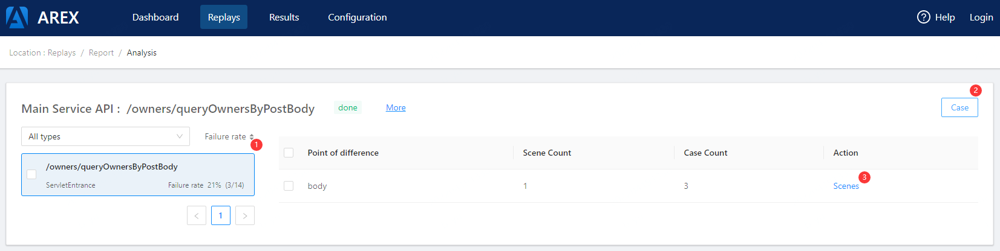
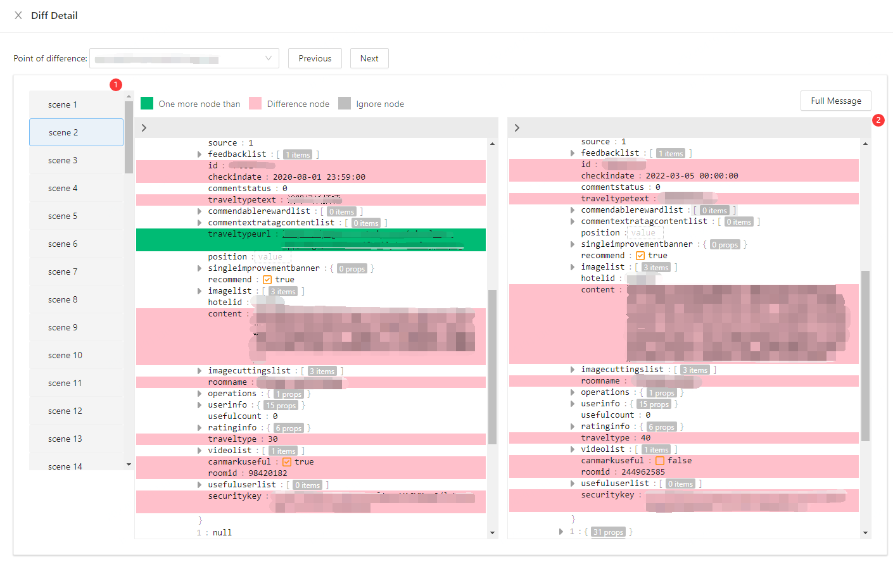
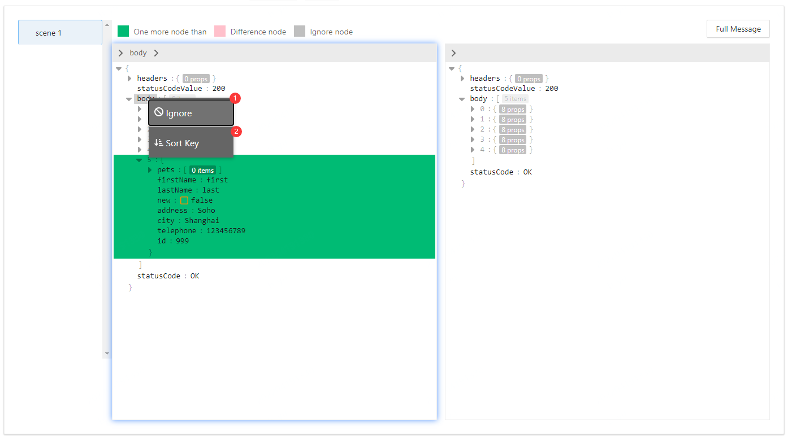

## REPLAYS
### application list
*This page lists all applications that have access to AREX*\

1. Start replay -- Starting a replay task. (Clicking button will show [Start replay config modal](#Start-replay-config))
2. Latest report -- Link to the latest report page. (Jump to [Report detail](#Report-detail) page)
### Start replay config
\
This page is displayed after the start replay button clicked
1. Target Host -- Tested service address
## RESULTS
### Task list
*This page lists all started replay tasks*\

1. report -- Jump to [Report detail](#Report-detail) page
### Report detail
*Usually, an application corresponds to multiple interfaces. This page lists the playback statistics of all interfaces in an application*\

1. Rerun -- Re-execute the playback of the application again, this operation will generate a new task
2. Result -- View the difference points of the interface. (Jump to [Difference page](#Difference-page))
3. Rerun(in table) -- Only execute the playback task of a certain interface, this operation will generate a new task
4. History -- Display the last 10 playback tasks
### Difference page
*This page shows all the difference points information in an interface*\

1. The list on the left lists all the dependencies of the tested interface, including the called interfaces, databases, redis, etc.
2. Case -- Show all playback test cases of the interface.
3. Scenes -- What's the meaning of 'Secne'? In json format, the scenes is to combine the difference points of the same parent node in order to prevent too many difference points. (Show [Difference detail](#Diff-detail) modal)
### Diff detail
*This page shows the difference details.*\

1. Scenes list in a difference point.
2. Comparison details\
The RED background indicates that the node values ​​are different\
The GREEN background indicates that it is an extra nodes relative to the other side\
The GREY background means nodes are ignored
### Quick config in diff tree

1. Ignore/Cancel Ignore -- Add/Remove Ignore configuration, globally effective
2. Sort key -- Solve the out-of-order array by specifying the sort field of the array node. This option is only displayed when right-clicking an array node. 
## CONFIGURATION

