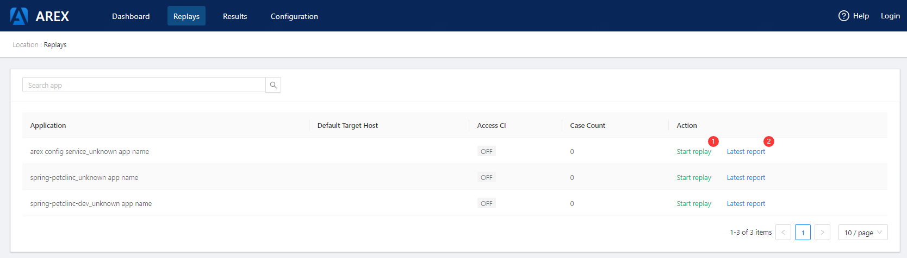
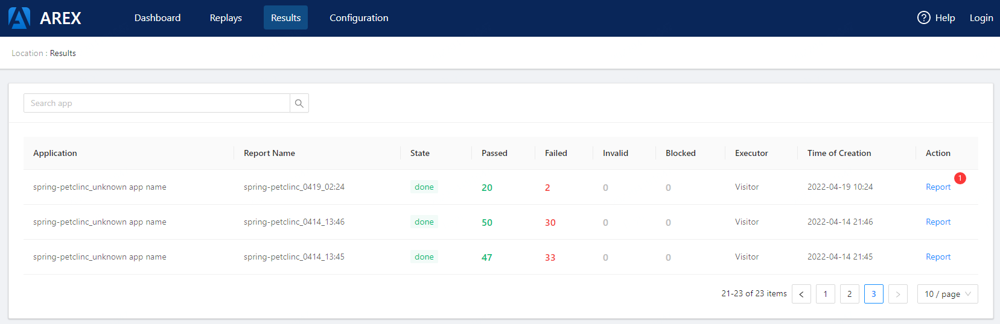
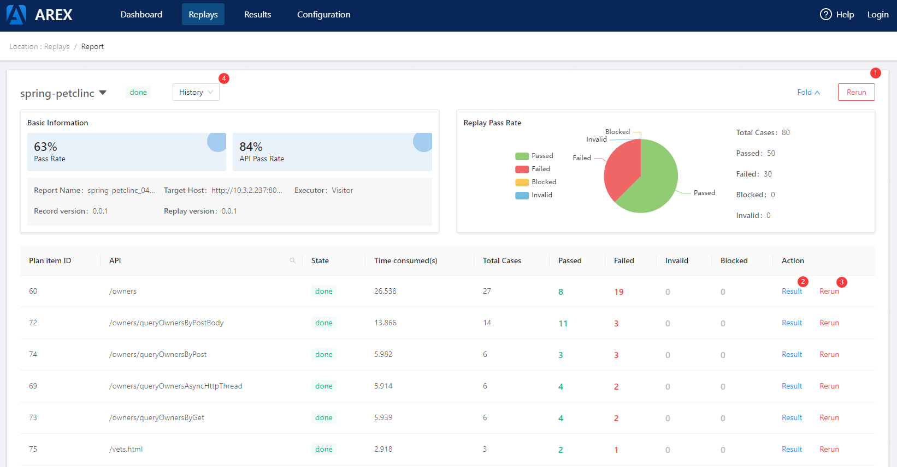

## REPLAYS
### application list
*This page lists all applications that have access to AREX*\

1. Start replay -- Starting a replay task. (Clicking button will show [Start replay config modal](#Start-replay-config))
2. Latest report -- Link to the latest report page.
### Start replay config
\
This page is displayed after the start replay button clicked
1. Target Host -- Tested service address
## RESULTS
### Task list
*This page lists all started replay tasks*\

1. report -- Jump to [Report detail](#Report-detail) page
### Report detail
*Usually, an application corresponds to multiple interfaces. This page lists the playback statistics of all interfaces in an application*\

1. Rerun -- Re-execute the playback of the application again, this operation will generate a new task
2. Result -- 
3. Rerun(in table) -- Only execute the playback task of a certain interface, this operation will generate a new task
4. History -- Display the last 10 playback tasks
## CONFIGURATION

